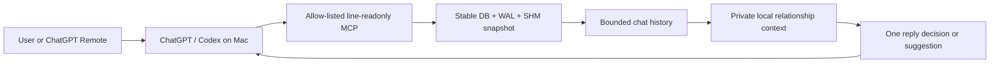

# LINE Context Relay

**LINE Context Relay — Read-only AI Chat Advisor for ChatGPT, Codex and MCP Agents**<br>
**LINE Context Relay — 給 ChatGPT、Codex 與 MCP Agent 使用的唯讀 LINE 聊天顧問**

[繁體中文](#繁體中文) · [English](#english) · [Security](SECURITY.md) · [Privacy](PRIVACY.md) · [MIT License](LICENSE)

A local-first, read-only LINE conversation assistant for macOS. It connects
ChatGPT/Codex to LINE Desktop's local encrypted database through a narrowly
allow-listed MCP server, refreshes the target chat using database evidence,
builds private relationship context, and suggests whether and how to reply.

**It never sends a LINE message.**

> Unofficial community project. Not affiliated with, endorsed by, or sponsored
> by LINE Corporation or OpenAI. Use only with your own account and data, and
> review the relevant product terms before use.

## English

### What this project does

LINE Context Relay turns a Mac running LINE Desktop and ChatGPT/Codex into a
private conversation-advice workflow:



With ChatGPT Remote enabled in the user's desktop/mobile setup, a request can
start from a phone, run on the paired Mac, read the local LINE context, and
return a suggestion to ChatGPT. Remote availability, locked-computer behavior,
and pairing depend on the installed ChatGPT version and must be verified on the
user's own devices. The Mac must be powered on, online, and signed into a usable
graphical session for LINE refresh actions.

The project is intentionally an **advisor, not a bot that sends messages**.
Reply text is displayed in ChatGPT/Codex only.

### Core features

- Stable copies of LINE's encrypted main DB and present WAL/SHM sidecars
- `SQLITE_OPEN_READONLY` and `query_only` on the private snapshot only
- Login Keychain-only database key retrieval
- Exact display-name or `chatId` resolution; ambiguous names fail closed
- Bounded history reads with stable timestamp/message-ID cursor pagination
- Target-specific latest-message refresh using DB evidence
- First-full-then-incremental local relationship context
- Optimistic context versions to prevent stale task overwrites
- A global `line-chat-advisor` Codex skill
- No send tool, generic input tool, arbitrary app target, OCR, screenshot, Shell
  MCP, or AppleScript MCP

### Safety architecture

The MCP exposes exactly eight operations:

| Tool | Purpose | Writes LINE source DB? |
| --- | --- | --- |
| `line_status` | Verify DB discovery, Keychain access, decryption, and snapshot state | No |
| `list_chats` | List recent exact chat candidates | No |
| `read_history` | Read bounded history and deduplicate it into private local memory | No |
| `refresh_latest` | Passively poll, then activate or launch only LINE if needed | No |
| `get_relationship_context` | Read private local semantic context | No |
| `save_relationship_context` | Save bounded context to local memory with cursor/version checks | No |
| `sync_older_messages` | Optional, constrained older-history backfill; not used for normal reads | No |
| `line_health` | Return redacted diagnostics | No |

`read_history` and `save_relationship_context` may write to the ignored local
memory database. They never modify LINE's source DB. See [PRIVACY.md](PRIVACY.md)
and [AUDIT.md](AUDIT.md) for the detailed boundary.

### Requirements

- macOS with LINE Desktop installed and signed in
- ChatGPT desktop with Codex/MCP support
- Node.js 20 or later
- Homebrew Python 3.14 compatible with the pinned `apsw-sqlite3mc` wheel
- Xcode Command Line Tools, Swift, LLDB, and Git
- macOS Login Keychain access
- Accessibility permission for the pinned local Peekaboo build; Screen Recording
  may also be requested by Peekaboo even though ordinary chat text comes from
  the DB, not screenshots
- Optional: ChatGPT Remote paired between the phone and Mac

### Installation

```bash
git clone https://github.com/LEO0047/line-chat-advisor-mcp-ai-assistant.git
cd line-chat-advisor-mcp-ai-assistant
scripts/bootstrap
scripts/build-peekaboo
```

`scripts/bootstrap` clones the three commits in [VENDOR_LOCK.md](VENDOR_LOCK.md)
without executing vendor code, installs hash-pinned Python and lockfile-pinned
Node dependencies, and runs the tests. `scripts/build-peekaboo` separately
builds only the reviewed Peekaboo commit into the ignored `runtime/` directory.

Register the MCP in `~/.codex/config.toml`, replacing the placeholder with the
absolute clone path:

```toml
[mcp_servers.line-readonly]
command = "/opt/homebrew/bin/node"
args = ["<absolute-project-path>/src/line-readonly-mcp/server.mjs"]
```

Install the global skill without copying private state:

```bash
mkdir -p "$HOME/.codex/skills"
ln -s "$(pwd)/skills/line-chat-advisor" "$HOME/.codex/skills/line-chat-advisor"
```

Do not overwrite an existing skill path without reviewing it. Restart/reload
ChatGPT/Codex after changing MCP or skill configuration.

### One-time key capture

LINE's local DB is encrypted. The project includes a deliberately isolated,
user-assisted capture path that stores the validated key directly in Login
Keychain and removes temporary artifacts:

```bash
scripts/prepare-key-capture
# Sign in only to the visible temporary LINE copy.
scripts/capture-key
scripts/cleanup-key-capture   # safe to run again if cleanup is needed
```

Read [SECURITY.md](SECURITY.md) and [AUDIT.md](AUDIT.md) first. Never paste the
key into a terminal command, `.env`, issue, log, prompt, or repository. The
technique may break after LINE/macOS updates and may be subject to LINE's terms;
use it only on your own Mac and account.

### Verify and run

```bash
npm run test
scripts/doctor
npm start
```

After reloading Codex, prompts such as these trigger the global skill:

```text
Read the latest LINE messages from <exact contact name>, use the full
relationship context, tell me whether I should reply, and if so give me only
one reply in my style. Do not send it.
```

The skill requires this sequence:

```text
line_status → refresh_latest → get_relationship_context → read_history
            → save_relationship_context
```

If freshness cannot be proven, it stops instead of presenting stale content as
current. If a reply is needed, it returns only one sentence. Otherwise it
returns `現在不用回。`

### Repository contents

- `src/line-readonly-mcp/` — Python DB bridge and Node MCP server
- `src/key-capture/` — isolated Keychain/key-validation helpers
- `skills/line-chat-advisor/` — global Codex skill source
- `scripts/` — bootstrap, build, doctor, capture, and cleanup commands
- `tests/` — Python and real stdio MCP tests
- `AUDIT.md` — upstream security review
- `VENDOR_LOCK.md` — source URLs and reviewed commits
- `ACCEPTANCE.md` — sanitized verification status

Dependencies, vendor working copies, build outputs, databases, snapshots,
screenshots, logs, keys, local memory, and contact material are intentionally
excluded from Git. They are recreated locally or remain private.

### Development

```bash
npm run test
scripts/doctor
git diff --check
```

Before changing a vendor pin, repeat the security audit. Never add a message
send path or a generic GUI/keyboard tool to the MCP allow-list.

### License

Original code in this repository is released under the [MIT License](LICENSE).
Fetched upstream projects remain under their own licenses. Their source,
license, and reviewed commit are listed in [VENDOR_LOCK.md](VENDOR_LOCK.md).

---

## 繁體中文

### 這是什麼

LINE Context Relay 是 macOS 上的本機優先、唯讀 LINE 聊天輔助機器人。
它透過受限 MCP 讓 ChatGPT/Codex 讀取 LINE Desktop 的本機加密資料庫，先用
DB 證據刷新精確目標聊天室，再結合完整關係脈絡，判斷現在該不該回；需要回覆
時只提供一句最像使用者的版本。

**本專案永遠不會傳送 LINE 訊息。** 建議只顯示在 ChatGPT/Codex。

若使用者的 ChatGPT 桌面版與手機已啟用並配對 ChatGPT Remote，可以由手機送出
任務，讓配對的 Mac 執行本機 LINE 讀取，再把建議帶回 ChatGPT。Remote、Locked
Use 與鎖定畫面下的實際可用性會隨版本與裝置狀態改變，必須在自己的設備實測；
Mac 仍需開機、連網，且已登入可用的圖形工作階段。

### 主要能力

- 對 LINE 主 DB、WAL、SHM 建立穩定私人副本
- 只用 `SQLITE_OPEN_READONLY` 與 `query_only` 開啟副本
- 解密金鑰只從 macOS Login Keychain 取得
- 精確名稱／`chatId` 解析，重名就停止而不是猜測
- 有上限的歷史讀取與 timestamp/message-ID cursor 分頁
- 以目標聊天室 DB 前進證據判定最新同步
- 第一次完整讀取，之後依 cursor 增量更新關係脈絡
- context version 防止不同 Codex task 互相覆蓋新版摘要
- 全域 `line-chat-advisor` skill
- 沒有 `send_message`、通用輸入、任意 app、OCR、截圖、Shell MCP 或
  AppleScript MCP

### 安全資料流

一般讀取固定依序執行：

```text
line_status → refresh_latest → get_relationship_context → read_history
            → save_relationship_context
```

`refresh_latest` 只有在目標聊天室的 timestamp/message ID 前進時才成功；若無法
證明資料已刷新，skill 會停止，不會拿舊訊息假裝最新。`read_history` 與
`save_relationship_context` 只會寫入被 Git 忽略、權限為 `0600` 的本機記憶，
永遠不會修改 LINE 來源 DB。

### 安裝

```bash
git clone https://github.com/LEO0047/line-chat-advisor-mcp-ai-assistant.git
cd line-chat-advisor-mcp-ai-assistant
scripts/bootstrap
scripts/build-peekaboo
```

`scripts/bootstrap` 會依 [VENDOR_LOCK.md](VENDOR_LOCK.md) 下載三個經審查的固定
commit，不執行 vendor 程式，接著安裝 lockfile／hash 鎖定依賴並跑測試。
Peekaboo 必須用獨立指令明確建置，產物只放在被忽略的 `runtime/`。

在 `~/.codex/config.toml` 註冊 MCP：

```toml
[mcp_servers.line-readonly]
command = "/opt/homebrew/bin/node"
args = ["<專案絕對路徑>/src/line-readonly-mcp/server.mjs"]
```

安裝全域 skill：

```bash
mkdir -p "$HOME/.codex/skills"
ln -s "$(pwd)/skills/line-chat-advisor" "$HOME/.codex/skills/line-chat-advisor"
```

修改 MCP 或 skill 後必須重新載入 ChatGPT/Codex，已開啟的 task 不會自動更新
啟動時載入的工具清單。

### 一次性金鑰擷取

LINE 本機 DB 有加密。專案提供隔離、需要使用者配合的一次性流程，驗證後直接
把金鑰寫入 Login Keychain，並刪除暫存檔：

```bash
scripts/prepare-key-capture
# 只登入畫面上可見的暫時 LINE 副本
scripts/capture-key
scripts/cleanup-key-capture
```

執行前請完整閱讀 [SECURITY.md](SECURITY.md) 與 [AUDIT.md](AUDIT.md)。金鑰不可
放入命令列、`.env`、Issue、log、prompt 或 Git。這項技術可能因 LINE/macOS 更新
失效，也可能受到 LINE 使用條款限制；只能用於自己的 Mac、帳號與資料。

### 驗證與使用

```bash
npm run test
scripts/doctor
npm start
```

重新載入 Codex 後，可使用：

```text
讀取 LINE：<聯絡人精確名稱> 的最近訊息，結合完整關係脈絡，告訴我現在該不該回；
需要回覆時只給我一句最像我的版本，不要傳送。
```

需要回覆時只會輸出一句建議；不需要時只輸出 `現在不用回。`；刷新或安全條件
不成立時只回報阻塞原因，不會改用 Computer Use、OCR 或舊快照。

### 隱私與公開範圍

以下內容永遠不進 Git：LINE DB/WAL/SHM、Keychain 金鑰、擷取候選值、聊天內容、
chatId、聯絡人名稱、截圖、OCR、log、本機 memory、dependency tree、vendor working
copy、binary 與 build artifacts。詳細規則見 [PRIVACY.md](PRIVACY.md)。

### 授權

本 repo 的原創程式採 [MIT License](LICENSE)。透過 bootstrap 下載的第三方專案
仍使用各自授權；來源、license 與固定 commit 請見
[VENDOR_LOCK.md](VENDOR_LOCK.md)。

本專案是非官方社群工具，與 LINE Corporation、OpenAI 無隸屬、贊助或背書關係。
